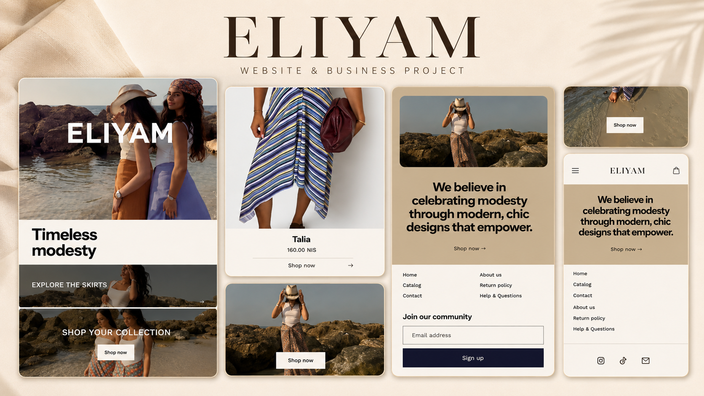

# Eliyam Website

## Project Overview

Responsive website created for Eliyam, focused on clear digital presentation, visual identity and user experience.

The project presents the brand, its services and contact options through a structured layout, mobile-friendly design and clear user flow.

## Objectives

- Build a professional online presence
- Present the brand clearly
- Improve credibility and service visibility
- Make contact actions easy
- Create a clean and consistent digital identity

## Approach

The website was structured around clarity, user experience and visual consistency.

The goal was to create a clean, responsive and professional website adapted to the brand’s needs and audience.

## Key Skills

- Website structure
- Responsive layout
- User experience
- UI layout
- Content organization
- Visual hierarchy
- Digital brand presentation
- Contact-oriented flow

## Status

Completed
